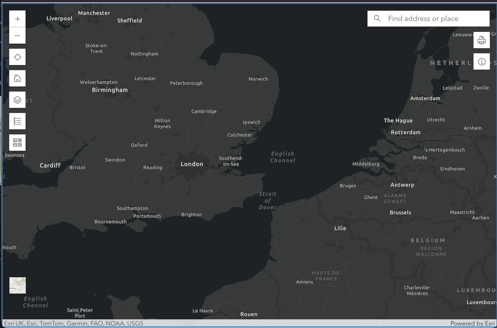

# arcgis-react-map
Very simple react mapping app with ESRI ArcGIS Javascript SDK, using React with ESRI Calcite components for the additional controls.

Parameters can be provided to load any map that is available without login on the ArcGIS Online Portal (AGOL), eg.

[USA](https://arcgis-react-map.netlify.app/?mapId=f2e9b762544945f390ca4ac3671cfa72) or
[San Francisco](https://arcgis-react-map.netlify.app/?mapId=bad7aec9c85040b882de64b8224f174c)

